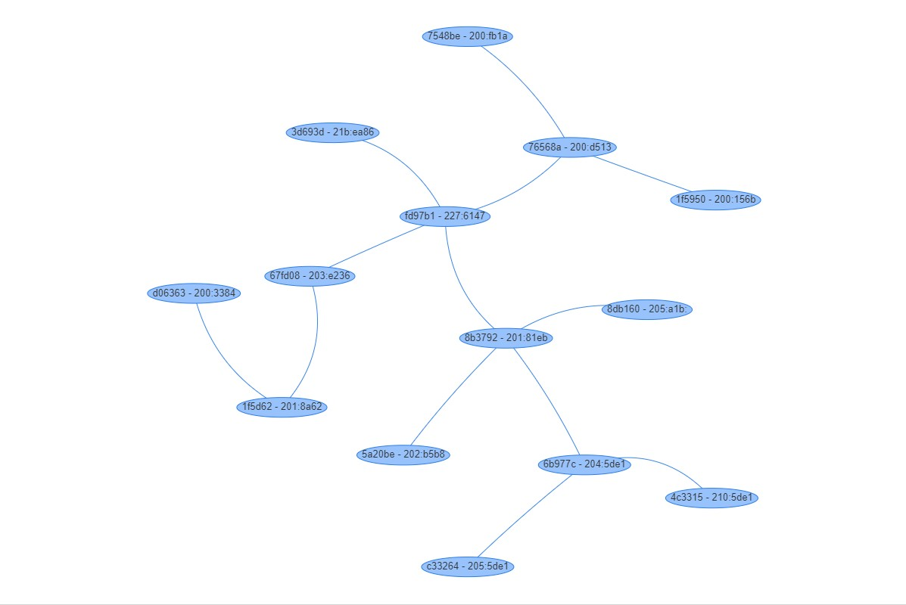
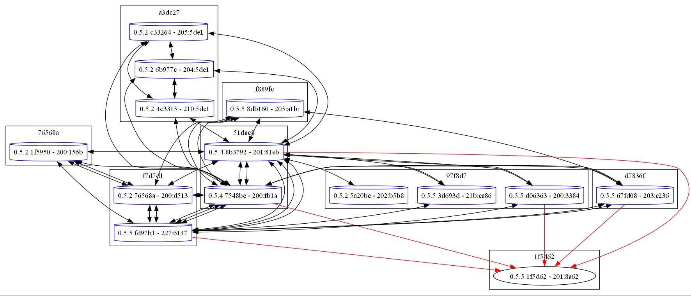

# Yggdrasil Map

Mapping service for [yggdrasil network](https://yggdrasil-network.github.io).

Rewritten from zero on fastapi&pydantic&asyncio, because [old](https://github.com/Arceliar/yggdrasil-map) version had too much pain in ass to maintain.

## Screenshot

### Paths mode

Shows paths between nodes



### Peers mode

Shows which node have which node in peers.



## How to run

### Prepare Yggdrasil daemon

You should enable undocumented option in your yggdrasil config: `LogLookups: true`

### Generic distro

```bash
poetry install
poetry run uvicorn app:app
```

### Nix

Indended to use with flakes.

It will tweak yggdrasil to log lookups automatically.

```nix
{
    inputs = {
        ygg-map = {
            url = "github:rubikoid/yggdrasil-map-ng";
            inputs.nixpkgs.follows = "nixpkgs";
        };
        outputs = { self, nixpkgs, ygg-map, ... } @ inputs: {
            nixosConfigurations.hostname = nixpkgs.lib.nixosSystem {
                modules = [
                    inputs.ygg-map.nixosModules.default
                    {
                        ygg-map = {
                            enable = true;
                            openFirewall = true;
                        };
                    }
                ]
            }
        }
    }
}
```

## Options

Options passed through environment vars.

- `refresh_seconds = 60 * 2` - timeout in seconds between map refresh.
- `socket = None` - path or `addr:port` to yggdrasil socket. Anyway it will find socket in few well-known places.
- `workers = 6` - number of workers to crawl map info. Big map craws _fast_ with 64 workers. For small maps, 2-8 is enough.
- `reload_bad = True` - enables (slow) attempt to crawl node info second time. Disable on big maps.

## Caveats

This was written for small (<100 hosts) isolated ygg subnet, which is not connected to big (>5000 hosts) mainline network.

Despite the fact that crawler can fetch network info for mainline net in reasonable time, current frontend unable to display this graph (sorry im backend monke).

So help with better displaying graph on frontend will be appreciated.
